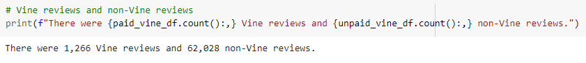
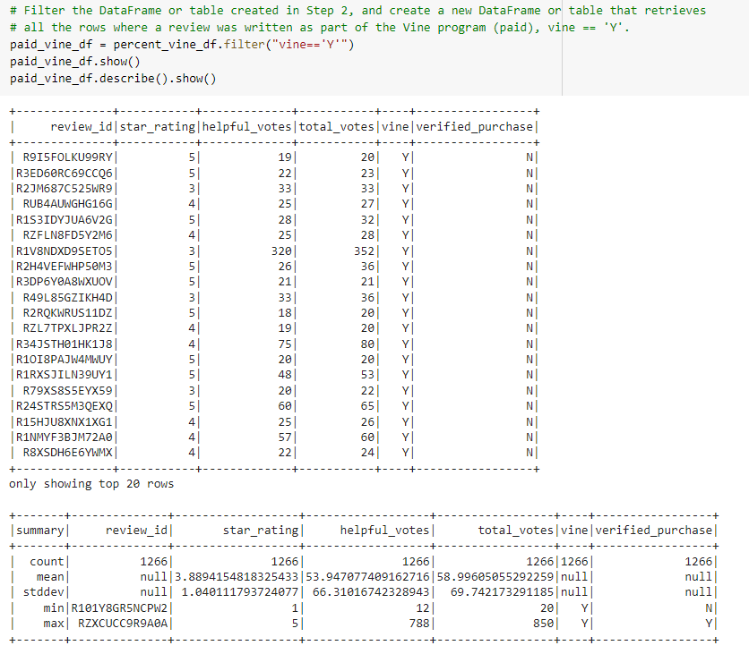
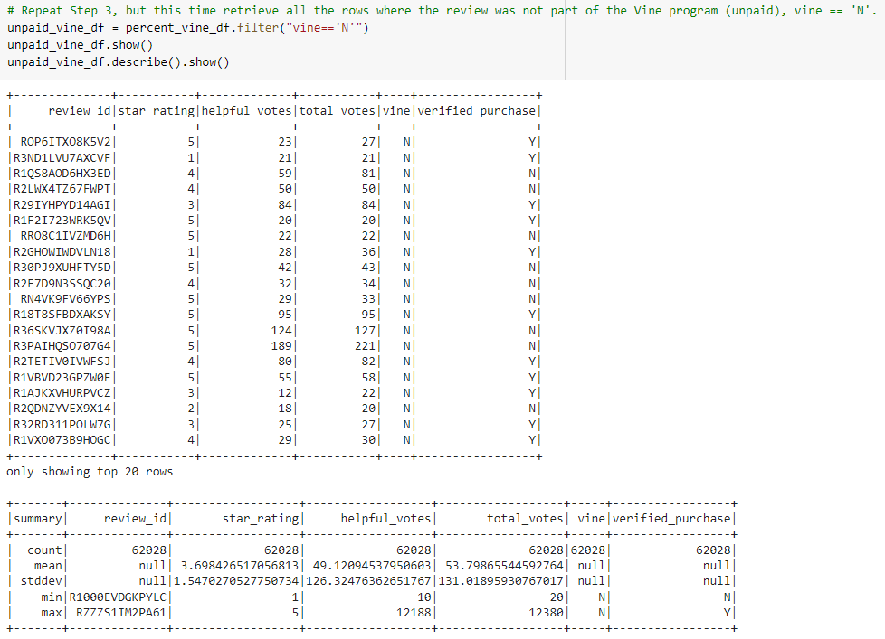
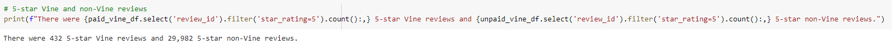
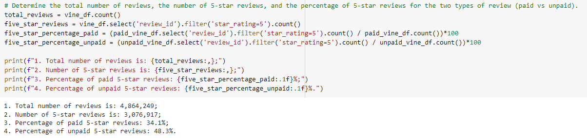
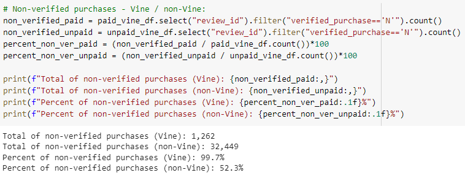
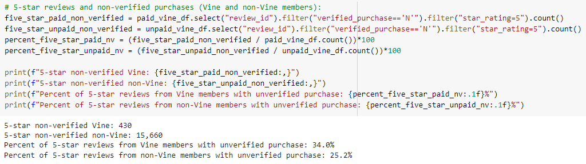

# Amazon Vine Analysis

## Overview of the analysis

We've been tasked with a project of analyzing Amazon reviews written by members of the paid Amazon Vine program. The Amazon Vine program is a service that allows manufacturers and publishers to receive reviews for their products. Companies that are selling their products on Amazon pay a small fee to Amazon and provide products to Amazon Vine members, who are then required to publish a review.

For this task the dataset of Toys reviews was chosen. The analysis was performed using knowledge of PySpark, AWS RDS and pgAdmin.

## Results

- How many Vine reviews and non-Vine reviews were there?

    
    
    

- How many Vine reviews were 5 stars? How many non-Vine reviews were 5 stars?

    

- What percentage of Vine reviews were 5 stars? What percentage of non-Vine reviews were 5 stars?

    

## Summary
From the above mentioned results we can see that there's no bias for reviews in the Vine program - the percentage of 5-star reviews left by Vine members is 34.1% when the percentage of non-Vine 5-star reviews is larger and equal to 48.3%.

Additional analysis was carried out for non-verified purchases. As per Amazon:
> Reviews that are not marked "Amazon Verified Purchase" are valuable as well, but we either can't confirm that the product was purchased at Amazon or the customer did not pay a price available to most Amazon shoppers.

The results of additional analysis are on the screenshot below:

We can see that almost all Vine reviews are not verified purchases. It makes sense since Amazon provides Amazon Vine members with free copies of products that have been submitted to the program by selling partners. And even those items were provided for free - the percentage of 5-star reviews is not high - means there's no bias for reviews in the Vine program.

As per non-Vine members the percentage of non-verified purchases is 52.3%, quite high. Let's have a look on 5-star reviews for non-verified purchases:

Since almost all Vine reviews are non-verified purchases there's no difference in percentage for 5-star reviews - it was 34.1% for all Vine reviews and 34.0% for Vine reviews that are non-verified purchases.

As for non-Vine members the percentage of 5-star reviews was 48.3%. As from above screenshot we can see that percentage of 5-star reviews with non-verified purchases is 25.2%. This makes the percentage of 5-star reviews from non-Vine members that have verified purchases equal to 23.1%.